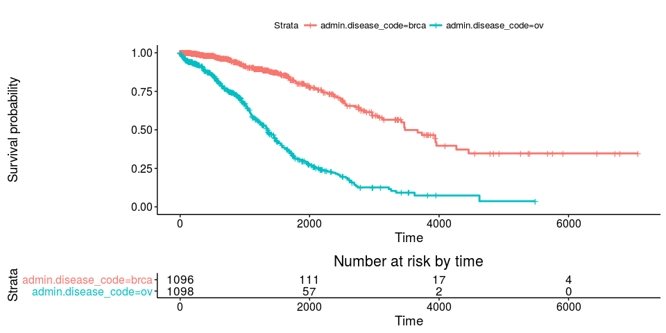
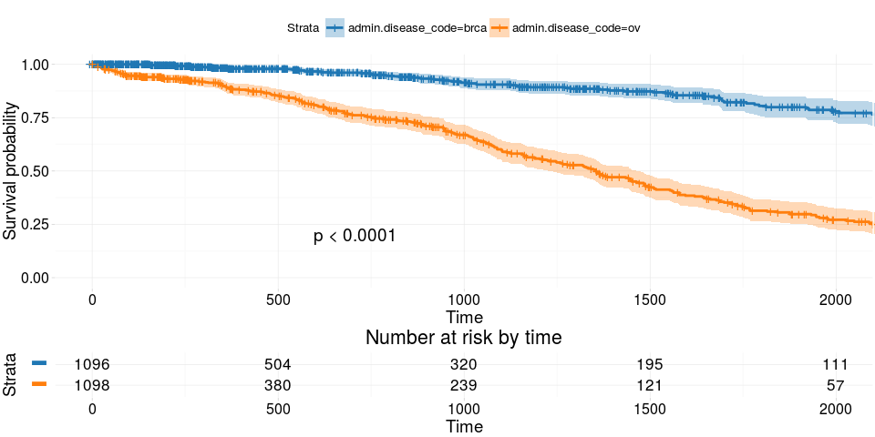
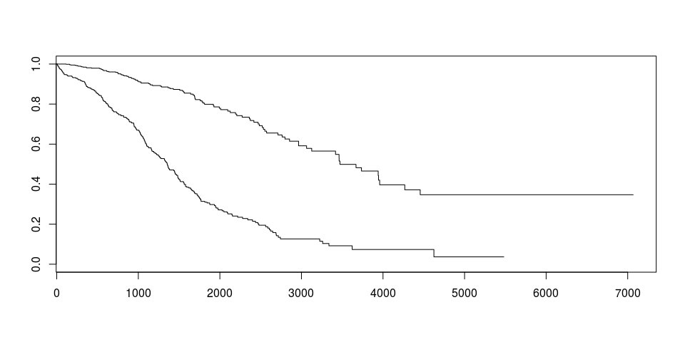
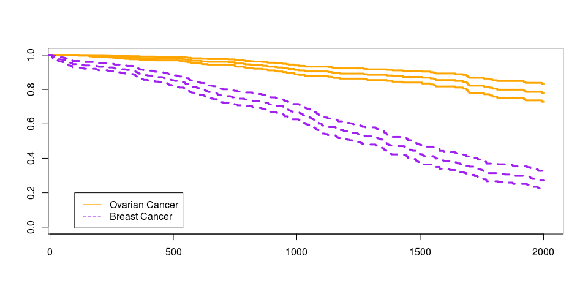
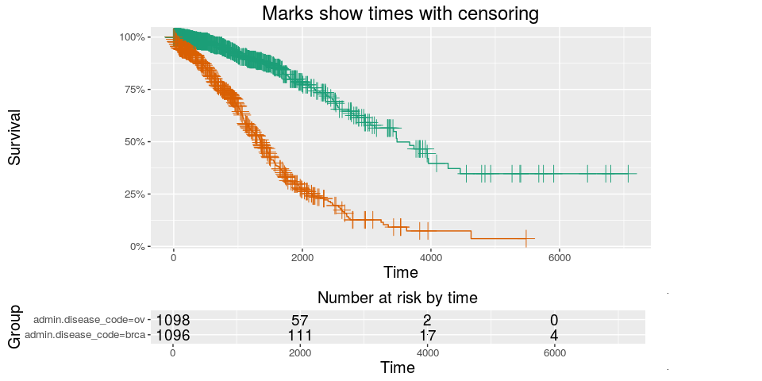
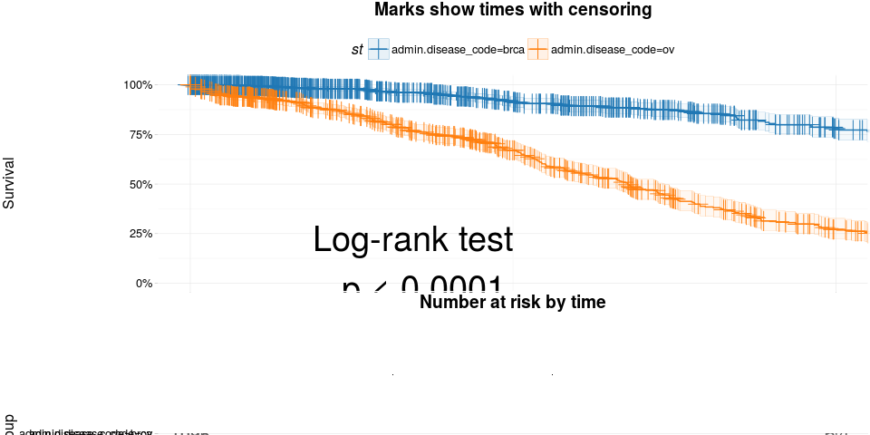

# Survival plots have never been so informative
Marcin Kosiński  


[Hadley Wickham's ggplot2 version 2.0 revolution](http://www.r-bloggers.com/ggplot-2-0-0/), at the end of 2015, triggered many crashes in dependent R packages, that finally led to deletions of few packages from [The Comprehensive R Archive Network](https://cran.r-project.org/). It occured that `survMisc` package was removed from CRAN on 27th of January 2016 and R world remained helpless in the struggle with the elegant visuliations of survival analysis. Then a new tool - [survminer](https://cran.rstudio.com/web/packages/survminer/index.html) package, created by [Alboukadel Kassambara](https://github.com/kassambara) - appeared on the R survival scene to fill the gap in visualizing the Kaplan-Meier estimates of survival curves in elegant grammar of graphics like way. This blog presents main features of core `ggsurvplot()` function from survminer package, *which creates the most informative, elegant and flexible survival plots that I have seen!*


During the development of [RTCGA](http://rtcga.github.io/RTCGA/) package (about which I wrote [here](http://r-addict.com/2016/05/04/RTCGA-Quick-Guide.html)) [we](https://github.com/orgs/RTCGA/people) encountered a need to provide the simplest possible interface to estimaes of survival curves for biotechnologists and [the discovery of `ggsurvplot()`](http://www.sthda.com/english/wiki/survminer-r-package-survival-data-analysis-and-visualization) was a bull's-eye! [Many have tried](https://github.com/hadley/ggplot2/issues/1080) to provide a package or function for ggplot2-like plots that would present the basic tool of survival analysis: Kaplan-Meier estimates of survival curves, but non of earlier tries have provided such a rich structure of features and flexibility as survminer. 
On basis of estimaes of survival curves one can infere on differences in survival times between compared groups, so survival plots are very useful and can be seen in amost every publication in the field of survival analysis and time to event models. 

# Example

After regular installation 


```r
install.packages('survminer')
source("https://bioconductor.org/biocLite.R")
biocLite("RTCGA.clinical") # data for examples
```

we can create simple estimates of survival curves just after we put `survfit` (survival package) object into `ggsurvplot()` function. Let's have a look at differences in survival times between patients suffering from Ovarian Cancer (*Ovarian serous cystadenocarcinoma*) and patients suffering from Breast Cancer (*Breast invasive carcinoma*), where data were collected by [The Cancer Genome Atlas Project](http://cancergenome.nih.gov/).


```r
library(RTCGA.clinical)
survivalTCGA(BRCA.clinical, OV.clinical,
             extract.cols = "admin.disease_code") -> BRCAOV.survInfo
library(survival)
fit <- survfit(Surv(times, patient.vital_status) ~ admin.disease_code,
               data = BRCAOV.survInfo)
library(survminer)
ggsurvplot(fit, risk.table = TRUE)
```

<!-- -->

This simple plot presents in an elegant way the estimates of survival probability depending on days from cancer diagnostics grouped on cancer types and a informative risk set table showing the number of patients that were under observation in the specific period of time. Survival analysis is a specific field of data analysis because of the censored time to event data, so risk set size is a must in visual inference.

After few improvements ([#1](https://github.com/kassambara/survminer/issues/1), [#2](https://github.com/kassambara/survminer/issues/2), [#3](https://github.com/kassambara/survminer/issues/3), [#4](https://github.com/kassambara/survminer/issues/4), [#7](https://github.com/kassambara/survminer/issues/7), [#8](https://github.com/kassambara/survminer/issues/8), [#12](https://github.com/kassambara/survminer/issues/12),
[#28](https://github.com/kassambara/survminer/issues/28)), made by Alboukadel in version 0.2.0, one can create a powerful, informative survival plot with such specification of parameters


```r
ggsurvplot(
   fit,                     # survfit object with calculated statistics.
   risk.table = TRUE,       # show risk table.
   pval = TRUE,             # show p-value of log-rank test.
   conf.int = TRUE,         # show confidence intervals for 
                            # point estimaes of survival curves.
   xlim = c(0,2000),        # present narrower X axis, but not affect
                            # survival estimates.
   break.time.by = 500,     # break X axis in time intervals by 500.
   ggtheme = theme_RTCGA(), # customize plot and risk table with a theme.
 risk.table.y.text.col = T, # colour risk table text annotations.
  risk.table.y.text = FALSE # show bars instead of names in text annotations
                            # in legend of risk table
)
```

<!-- -->

Each parameter is described in the correspoding comment, but I would like to emphasize the `xlim` parameter which controls limits of the X axis but does not affect the survival curves that are taking into account all possible times. Another brilliant parameter is `break.time.by` that affects survival plots and the risk set table, which would not be so easy to create it by yourself. Also a `ggtheme` parameter is beneficial for easy plot customization. Finally, `risk.table.y.text` and `risk.table.y.text.col` (for which I have provided a user request) are useful parameters that change text (often too long and redundand) from risk table legend into narrow, coloured bar. This saves a lot of space in the final plot.

# Comparisons

Even though [`survMisc`](https://cran.rstudio.com/web/packages/survMisc/index.html) have returned on CRAN, I've appreciated survminer so much that I would not look anymore on other solutions. Check why: at the end I present survival curves that can be obtained with the usage of `base` package and `survMisc` package.

### base package


```r
plot(fit) # base
```

<!-- -->

```r
plot(fit, col=c("orange","purple"), lty=c(1:2), lwd=3, # base with some customization
     conf.int = TRUE, xmax = 2000)
# add legend
legend(100, .2, c("Ovarian Cancer", "Breast Cancer"), 
       lty = c(1:2), col=c("orange","purple"))
```

<!-- -->

I haven't seen examples with risk table and adding legend isn't so quick as in survminer.

### survMisc package


```r
# install.packages('survMisc')
library(survMisc)
survMisc:::autoplot.survfit(fit) # no customization
```

<!-- -->

Why colours are not asigned to any group? Where is the legend? Why there is so much white space at the right?


```r
survMisc:::autoplot.survfit( # with some hard customization
   fit,
   type = "fill",
   pVal=TRUE
) -> fit.survMisc 
fit.survMisc$table <- fit.survMisc$table +
   theme_RTCGA() + # theme(legend.position = "top")
   coord_cartesian(xlim = c(0,2000))
fit.survMisc$plot <- fit.survMisc$plot +
   theme_RTCGA() + 
   coord_cartesian(xlim = c(0,2000))
survMisc:::print.tableAndPlot(fit.survMisc)
```

<!-- -->

Where is risk table? Why I can't pass `break.by.time` to have informative minor X axis breaks? Why the plot gets narrower when the legend in risk table gets wider and why I can't do anything to workaround this? 

> Never mind -> `install.packages('survminer')`
